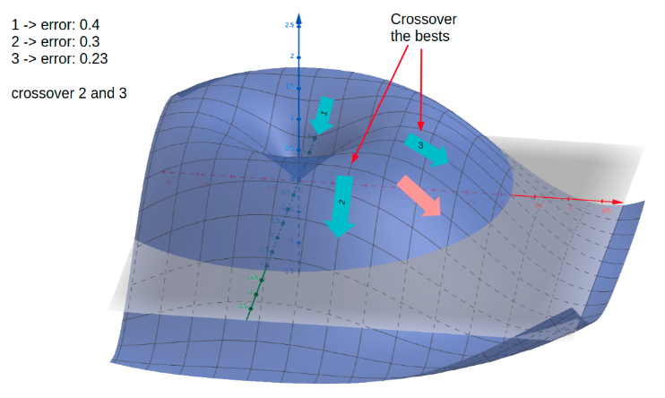

# Genetic Deep Learning
This project aims to use genetic algorithms to boost the learning of DNN.  Building and training a family  of NN with same structure and hyperparameters from scratch but starting from different random weights.   After a few epochs of training, the networks that perform better are chosen and crossedover their weights together in order to mating between pairs and produce the next generation. 

Main problems to solve with NN:

- Architecture optimization:finding optimal layers and number of nodes in each layer of the network required to capture features from given data.
- Hyperparameter optimization: refers to choosing values of hyperparameters like - learning rate, optimization algorithm, dropout rate, batch size, etc. 

- Weight optimization: fiend the right values for each neuron within each weight in order to solve the gereal equation with a minimum error.

this project focuses on solving the third of the problems, using Genetic Algorithms combined with Gradient Descent to create a novel method of solving the weight optimization problem.

## Weight Crossover Intuition

