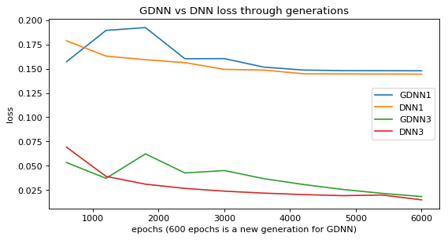
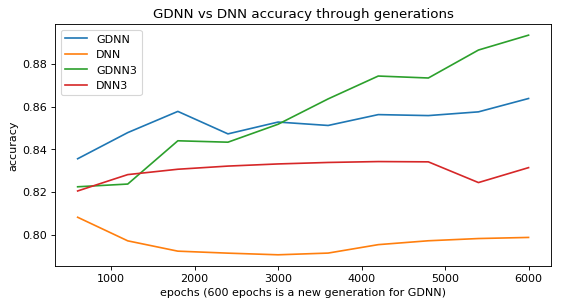

# Genetic Deep Learning
[](https://app.codacy.com/app/patelotech/genetic_deep_learning?utm_source=github.com&utm_medium=referral&utm_content=patelotech/genetic_deep_learning&utm_campaign=Badge_Grade_Dashboard)
[](https://travis-ci.org/patelotech/genetic_deep_learning)
[](https://coveralls.io/github/patelotech/genetic_deep_learning?branch=master)
[](https://github.com/gmaggiotti/genetic_deep_learning/blob/master/LICENSE.md)
[]()

This project aims to use genetic algorithms to boost the learning of DNN.  Building and training a family  of NN with same structure and hyperparameters from scratch but starting from different random weights.   After a few epochs of training, the networks that perform better are chosen and crossover their weights in order to mating and produce the next generation. 

Main problems to solve with NN:

-   Architecture optimization:finding optimal layers and number of nodes in each layer of the network required to capture features from given data.
-   Hyperparameter optimization: refers to choosing values of hyperparameters like - learning rate, optimization algorithm, dropout rate, batch size, etc. 
-   Weight optimization: find the right values for each neuron within each weight in order to solve the general equation with a minimum error.

This project is focused on solving weight optimization, using Genetic Algorithms combined with Gradient Descent and implement a method to make the process faster.

## Intuition of how gradients of the new generations improves the chosen slope when mating the fittest

 The ”Survival of the Fittest” scheme, proposed by Charles Darwin in his Theory of Natural Selection, is used.  The mating process takes place after every ’n’ epoch, in this example n=600. After the first generation of parents are trained for ’n’ iterations, their dominance is calculated based on their ability to reduce loss.  Networks that achieve less loss are selected to create the new generation.


Comparison of the loss of the GDNN, choosing the best NN within each generation (where each generations occurs within 600 epochs),  vs the loss of DNN.




## Set-up

` git clone https://github.com/gmaggiotti/genetic_deep_learning `

` pip install -r requirements.txt `

## Example Usage

```python
from NN1 import NN1
from sklearn.model_selection import train_test_split
from nn_utils import run_GDNN_model, read_dataset

X, Y = read_dataset(180, 500)
train_x, test_x, train_y, test_y = train_test_split(X, Y, test_size=0.3, random_state=1)

epochs = 600
population_size = 10
generations = 10

dataset = train_x, train_y, test_x, test_y
run_GDNN_model(NN1, epochs, population_size, generations, dataset)

```
results:

```python

600,0.168544190248,0.853358180509,0.365456152434
1200,0.190101287106,0.86226507466,0.351355096229
1800,0.171879024117,0.845500071458,0.373490978584
2400,0.197814229677,0.843125854644,0.376948511977
3000,0.175281053543,0.846390250419,0.374509228029
3600,0.174354637606,0.846694537943,0.371549666719
4200,0.177174209814,0.854009316851,0.367267148903
4800,0.153127387675,0.856748424631,0.35567444011
5400,0.145970882656,0.859319560831,0.349651657185
6000,0.145480255007,0.859810989131,0.349801966101


```

## Linting

-   **Style:** PEP8
[PEP8](https://www.python.org/dev/peps/pep-0008/ "Pep 8")

### Versioning

-   pylint 2.2.2
-   astroid 2.1.0
-   autopep8 1.4.3 (pycodestyle: 2.4.0)

### Linting scripts

-   Error check: `pylint src`
-   Error fix:  `autopep8 --in-place --aggressive --aggressive src`

Copyright (c) 2018 Gabriel A. Maggiotti
